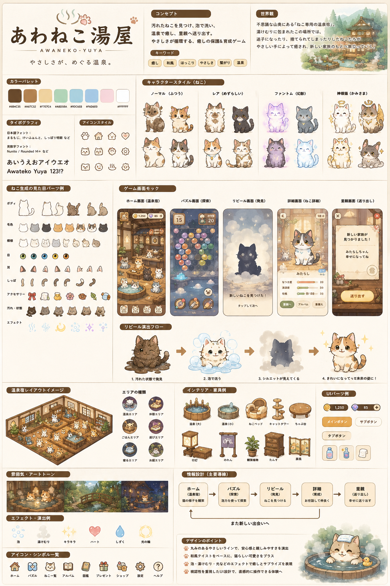

# あわねこ湯屋 Design Sheet

Reference image:

This document and `assets/reference/awaneko_design_sheet.png` are the repository source of truth for the planning and asset production direction.

## Visual Tone

- Warm watercolor storybook style.
- Japanese soft onsen atmosphere with wooden interiors, steam, lantern glow, plants, noren, and quiet bathhouse details.
- Cozy rescue fantasy mood focused on care, discovery, washing, reveal, and gentle send-off.
- Handmade, low-stress, healing-game feeling.

## Color Palette

- Dark cocoa brown for primary labels, outlines, and important UI framing.
- Medium warm brown and tan for wood UI, furniture, and buttons.
- Cream and white for paper panels and calm negative space.
- Pastel accents: pale yellow, mint green, muted sky blue, light periwinkle, and soft blush pink.
- Avoid neon, metallic, glossy, hard-contrast, or high-saturation anime palettes.

## Typography Mood

- Rounded and friendly Japanese display lettering for the title/logo mood.
- Rounded sans UI text with soft spacing and approachable weight.
- Text should feel warm and legible, never futuristic, sharp, aggressive, or battle-oriented.

## UI Composition

- Cream paper-board layout with thin beige dividers.
- Cocoa-brown rounded section labels resembling soft wood tabs.
- Compact but calm panels with consistent margins.
- Mobile screens use rounded phone frames, soft tan controls, bottom icon navigation, small counters, and paper-like modal panels.
- Buttons are rounded, warm tan or cream, and lightly framed with brown outlines.

## Cat Proportions

- Large head, short rounded body, small paws, soft cheeks, rounded ears, simple tails.
- Gentle expressive eyes and small mouths.
- Dirt, accessories, eyes, mouths, tails, patterns, and effects should be separable layered parts.
- Rare or fantasy cats may use glow, halo, wings, or soft sparkles, but must stay gentle and rounded.

## Rendering Softness

- Watercolor wash with paper texture.
- Pencil-like cocoa-brown outlines.
- Feathered shadows and low contrast.
- Gentle lighting and soft steam/fog.
- No hard cel-shading, realistic fur rendering, or sharp glossy highlights.

## Icon Style

- Rounded brown line icons.
- Simple silhouettes with occasional pastel fills.
- Home, bath, cat, album/book, gift, shop, settings, and help icons should feel hand-drawn and calm.

## Panel Framing

- Soft cream panels with thin tan/brown borders.
- Dark brown rounded header tabs.
- UI should feel crafted from paper and wood, not plastic or metal.

## Effect Vocabulary

- Translucent bubbles.
- Pale steam and fog.
- Small warm sparkles.
- Hearts, tear drops, moon glow, and light rings.
- Effects should be quiet, low opacity, and celebratory without aggressive impact.

## Environment Art

- Cozy Japanese bathhouse interiors with warm wood, bath tubs, lanterns, noren, shelves, low tables, plants, and cushions.
- Exterior or puzzle settings can include misty mountain forest paths, hidden onsen buildings, bridges, and night bath scenes.
- Backgrounds should preserve readability for UI overlays and cat sprites.

## Spacing Density

- The reference sheet is dense for communication, but gameplay screens must keep comfortable mobile touch targets.
- Panels should be compact and readable, with enough breathing room for steam and soft effects.

## Interaction Tone

- Tap to discover, wash, reveal, inspect, and send off.
- Interactions should feel gentle, caring, and ceremonial.
- Avoid PvP, battle, pressure, fail-state drama, or aggressive reward effects.

## Sprite Layering Hints

Recommended future cat layer order:

1. floor contact shadow
2. body
3. tail
4. fur pattern
5. dirt or soot
6. eyes
7. mouth
8. accessory
9. foreground bubbles, steam, sparkles, or reveal glow

Use stable canvas sizes and center-bottom anchors so layered cat parts remain aligned across common, rare, fantasy, and divine variants.
